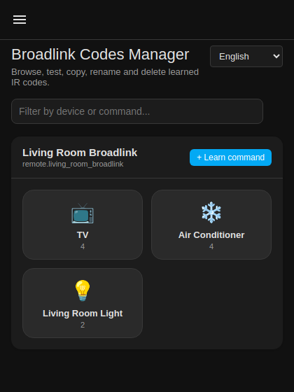
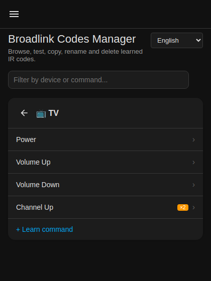
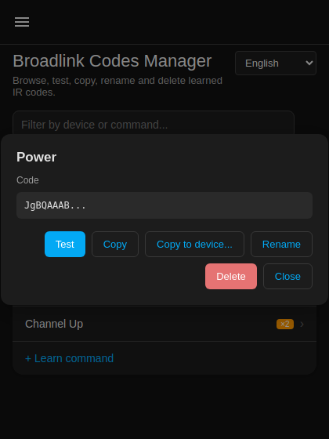

# Broadlink Codes Manager

[](https://github.com/kdinya/ha-broadlink-codes-manager/actions/workflows/validate.yml)
[](https://github.com/hacs/integration)
[](LICENSE)

A sidebar panel for Home Assistant to browse, test, copy, rename, delete
and learn Broadlink IR/RF codes — without editing
`.storage/broadlink_remote_<mac>_codes` by hand.

> **Status: v1.3.5.** Built from a design spec and a review of the
> Broadlink integration's source in `home-assistant/core`. The
> integration's service logic has an automated test suite (see
> [Tests](#tests) below), but the integration itself is still **not yet
> verified against a live Home Assistant instance.** Please open an
> issue with your HA version if something doesn't load — see
> [Known limitations](#known-limitations--how-it-works) below for why.

## Screenshots

| Devices | Commands | Command detail |
|---|---|---|
|  |  |  |

## Features

- Sidebar panel (admin-only), not a Lovelace card — this is a
  maintenance tool, it needs room for a table and bulk actions. Includes
  its own menu button so the standard Home Assistant sidebar stays
  reachable (narrow/mobile layouts, or an auto-hidden sidebar, no longer
  strand you on this panel with no way back).
- Per remote → per device → command table: **Test**, **Copy**,
  **Copy to device**, **Rename**, **Delete**. Clicking a command's name
  opens a detail view with the full code and all of the above actions
  in one place.
- **Copy to device** — copy a learned command onto another device, on
  the same remote or a completely different Broadlink remote entity.
  Codes aren't tied to a specific MAC address, so this is a plain data
  copy (no re-learning, no button press needed), with overwrite
  protection unless you explicitly opt in.
- **Delete device** — removes every command on a device in one call.
- **Learn command** — create a new device and/or learn a new command
  from the panel (wraps `remote.learn_command`, reports success/failure
  back instead of leaving you guessing).
- Filter/search across devices and commands.
- Toggle commands (learned with `alternative=True`) are labelled, not
  silently treated as plain commands.

## Installation

No YAML editing at any point — this is a UI-only integration.

### HACS (custom repository)

1. HACS → Integrations → ⋮ → Custom repositories.
2. Add `https://github.com/kdinya/ha-broadlink-codes-manager`, category
   *Integration*.
3. Install **Broadlink Codes Manager**, restart Home Assistant.
4. Settings → Devices & Services → **Add Integration** → search
   *Broadlink Codes Manager* → Submit. That's it — one instance is all
   that's needed, and it takes no configuration fields.
5. A **Broadlink Codes** entry appears in the sidebar for admin users.

### Manual

Copy `custom_components/broadlink_codes_manager/` into your HA
`config/custom_components/` folder, restart HA, then do step 4 above.

## Services

| Service | Purpose |
|---|---|
| `broadlink_codes_manager.list_codes` | Returns all remotes + codes (response data). Used by the panel. |
| `broadlink_codes_manager.rename_command` | Rename a command in place, no re-learning. |
| `broadlink_codes_manager.copy_command` | Copy a command onto another device, optionally on a different remote entity. |
| `broadlink_codes_manager.learn_command` | Wraps `remote.learn_command` with a response so you know if it actually worked. |

Deleting and sending codes reuse Home Assistant's own
`remote.delete_command` / `remote.send_command` — no point reinventing
those.

## Tests

The integration's service logic (rename, copy, learn, list, and safe
access to live `BroadlinkRemote` entities) has an automated `pytest`
suite.

The tests run against a small, local stand-in for the pieces of Home
Assistant this integration actually touches (`tests/_ha_stub/`) - not a
real HA instance - so they're fast and dependency-light, but they are
**not** a substitute for the "not yet verified against a live HA
instance" caveat above. They exist to pin down this integration's own
logic (locking, error handling, toggle-list copying, overwrite
protection) independent of that.

```bash
pip install -r requirements-test.txt
pytest
```

`tests/` layout:

```
tests/
  _ha_stub/                     # minimal homeassistant.* stand-ins, test-only
  conftest.py
  test_entity_access.py         # defensive access to live BroadlinkRemote entities
  test_services.py              # list_codes / rename_command / copy_command / learn_command
```

## Known limitations & how it works

- **Reads/writes go through the live `BroadlinkRemote` entity object**
  (via `homeassistant.helpers.entity_platform`), not a second `Store`
  pointed at the same file. That avoids the race where HA's own
  periodic flush could clobber a concurrent direct file write. The
  trade-off: this relies on the entity's private attributes (`_codes`,
  `_code_storage`, `_lock`). Those are stable in practice but **not a
  public API**, and could change in a future HA release without a
  deprecation notice. If that happens, the panel will show "no Broadlink
  remotes found" and the log will explain why — it won't crash silently.
- **Repeat sequences** (e.g. separate "once"/"repeat" blocks in some IR
  formats) are outside this integration's scope — it stores and
  replays exactly the base64 payload Broadlink itself produced.
- **IR only.** RF (315/433 MHz) codes are a different physical layer and
  are intentionally out of scope.
- The panel's static file is served via `hass.http.register_static_path`
  (with a fallback to the newer `async_register_static_paths` /
  `StaticPathConfig` API introduced in HA 2024.7) — this code path is
  the least tested part of the integration; please report if the panel
  doesn't appear.
- **Brand icon.** As of Home Assistant 2026.3, custom integrations ship
  their own brand icon directly instead of submitting to the separate
  `home-assistant/brands` repository (which stopped accepting new
  custom-integration icons for exactly this reason). This repo includes
  one at `custom_components/broadlink_codes_manager/brand/icon.png`.
  Note: at the time of writing, HACS's own download-list UI has a
  [known bug](https://github.com/hacs/integration/issues/5223) where it
  still looks for icons at the old CDN location and shows a placeholder
  for integrations using the new inline mechanism - that's a HACS-side
  issue, not something fixable from this repo; the icon still displays
  correctly everywhere else in HA once installed.

## Changelog

### v1.3.5

- **Fixed:** long device names could overflow past the edge of their
  tile in the device grid instead of truncating - the truncation CSS
  was on an inline `<span>` with no defined width, so it never
  actually applied. Now correctly ellipsizes (`Home Theater Sound...`)
  and the command count stays reliably underneath the name (previously
  it could end up on the same line as a short name instead of always
  stacking below it, since neither element was block-level).
- **Added:** real screenshots to the README (device grid, command
  list, command detail dialog) - also brings the README in line with
  HACS's own recommendation to include images.

### v1.3.4

- **Fixed:** switched to the correct, current way of shipping a brand
  icon. The `home-assistant/brands` repository stopped accepting new
  custom-integration icons as of HA 2026.3 - it now expects them
  bundled with the integration itself
  (`custom_components/broadlink_codes_manager/brand/icon.png`), which
  this release adds. The PR opened against `home-assistant/brands` in
  v1.3.3 was auto-closed by their bot for this reason and is no longer
  needed.

### v1.3.3

- **Fixed:** the config flow's duplicate-instance abort didn't pass
  the `single_instance_allowed` error key, so it fell back to HA's
  default `already_configured` reason - which has no matching entry
  in this integration's `strings.json`/`translations`, so it would
  have shown an untranslated raw key instead of the intended message.
  Now passes the key explicitly so it matches.
- **Added:** CI (GitHub Actions) running `hassfest`, the official HACS
  validation action, and `pytest` on every push/PR and weekly.
- **Fixed:** the GitHub repository itself was missing a description
  and topics, which HACS needs to validate and list a custom
  repository properly.
- Confirmed `manifest.json` has every key HACS/hassfest require and no
  unrecognized ones, `hacs.json` is correctly configured for a
  `content_in_root: false` integration, and `LICENSE` (MIT) is present.

### v1.3.2

- **Redesigned:** the command chip grid was replaced with an icon
  tile grid for devices (TV, AC, light, fan, etc. get a matching
  icon) and a plain vertical list for a device's commands once you
  tap into it - easier to scan than a wrap of same-sized chips,
  especially for devices with many commands.

### v1.3.1

- **Fixed:** the panel could show the literal text "null" next to the
  "Learn command" button when a Broadlink remote's name came from the
  device registry rather than the entity itself. The friendly name is
  now resolved the same way Home Assistant itself resolves it.
- **Fixed:** the "Copy to device" dialog's device field is now a real
  dropdown of existing devices (plus an explicit "new device" option)
  instead of a text field with browser suggestions, which several
  mobile browsers don't surface as a visible picker at all.
- **Changed:** "Learn command" now has two distinct flows - the
  button in a remote's header creates a new device, while a "+" inside
  an existing device's command list learns a new command for that
  device specifically (shown as a fixed, non-editable field so you
  can't accidentally learn into the wrong device).
- **Fixed:** long remote/device names no longer push the header's
  action button onto its own line - the title now truncates instead.

### v1.3.0

- General cleanup and test-suite maintenance.

### v1.2.0

- **New: Copy to device.** Copy a learned command onto another device -
  same remote or a different Broadlink remote entity entirely - without
  re-learning. New `broadlink_codes_manager.copy_command` service, with
  overwrite protection unless explicitly requested, plus a "Copy to
  device..." action in the panel (per row and in the command detail
  view).
- **New: command detail view.** Clicking a command's name now opens a
  dialog with its full code (previously only a truncated preview was
  ever visible) and every action - Test, Copy, Copy to device, Rename,
  Delete - in one place.
- **New: automated test suite** for the integration's service logic.
- **Fixed: sidebar navigation.** The panel now renders its own menu
  button, matching native Home Assistant panels. Previously, opening
  this panel on a narrow/mobile layout (or with the sidebar set to
  auto-hide) could leave you with no way back to the sidebar without
  navigating away by URL.

### v1.1.1

- Fixed the "Copy" button silently failing on setups where the
  `navigator.clipboard` API is unavailable (e.g. plain-HTTP access to
  Home Assistant, which has no secure-context clipboard access) — now
  falls back to a hidden-textarea + `execCommand("copy")` approach.
- Replaced every browser-native `confirm()` / `prompt()` / `alert()`
  popup (delete command, delete device, rename, learn command) with
  in-panel modal dialogs styled to match Home Assistant.
- Added a language selector to the panel, with Ukrainian (Українська)
  alongside English; the config-flow dialog is now also translated.
- General UI polish: card-style layout, collapsible device rows with a
  chevron indicator, escaped HTML in all user-supplied names to avoid
  markup injection in the panel.
- Confirmed (and documented) that there is intentionally no
  "add device" flow — devices are created implicitly the first time
  you learn a command on a new device name.

## Roadmap

- Export/import full backup as JSON, one click.
- Duplicate-code highlighting.

## Contributing

Issues and PRs welcome, especially real-world testing reports (HA
version + what broke) since this was built and reviewed against source
but not yet run live. Every push and PR runs `pytest`, `hassfest`, and
the official [HACS validation action](https://github.com/hacs/action)
(see the badge above) - all three should stay green.

## License

MIT — see [LICENSE](LICENSE).
